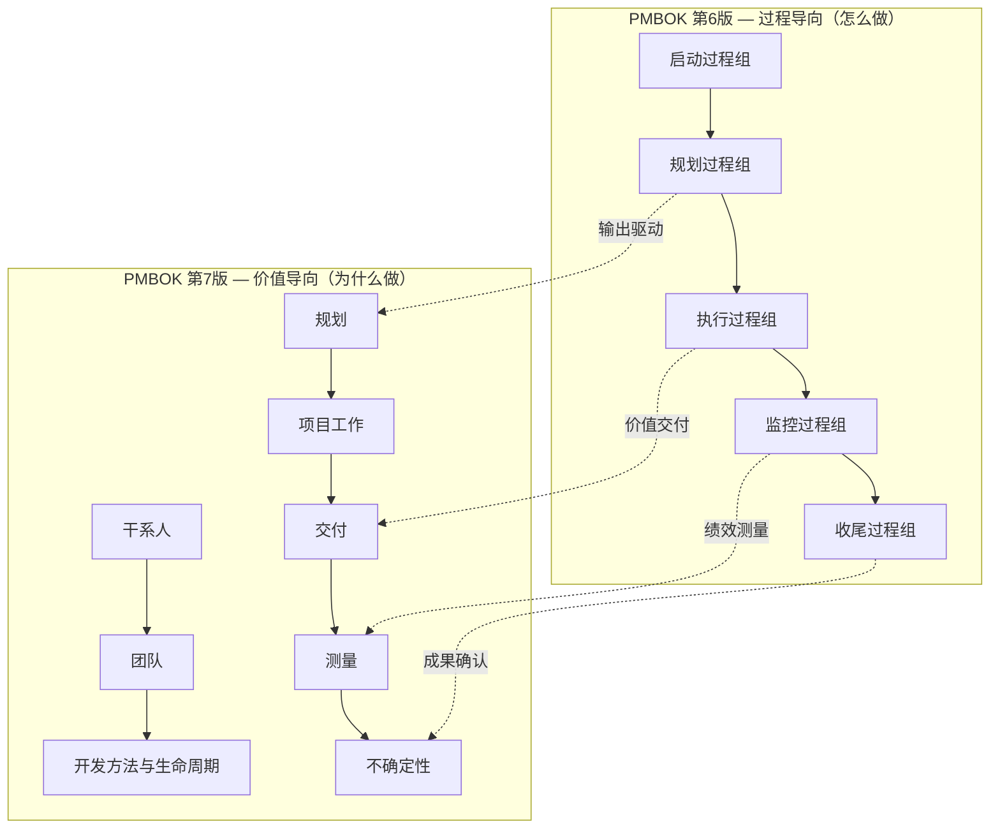
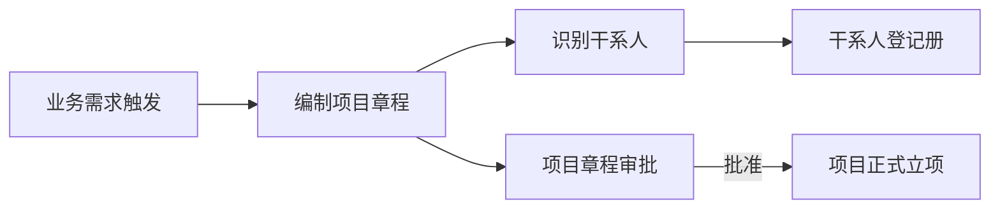
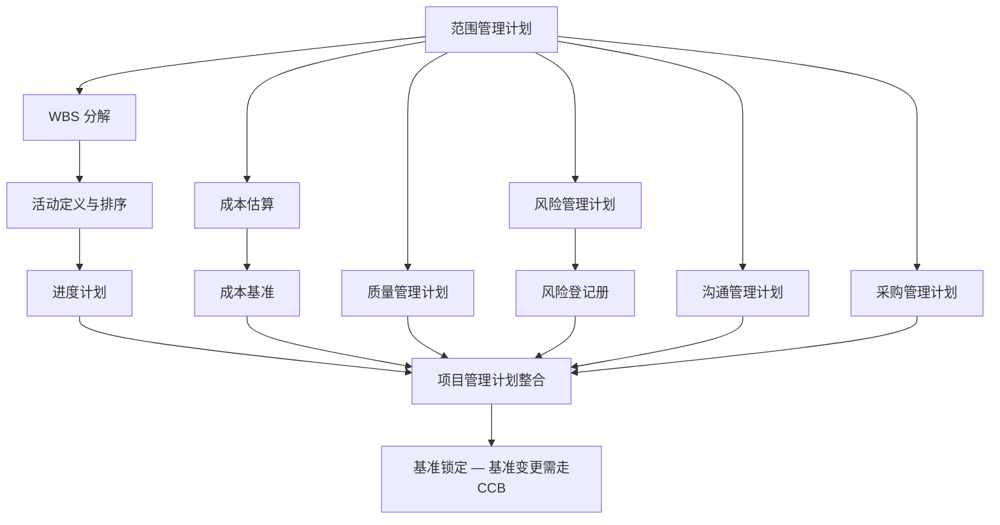
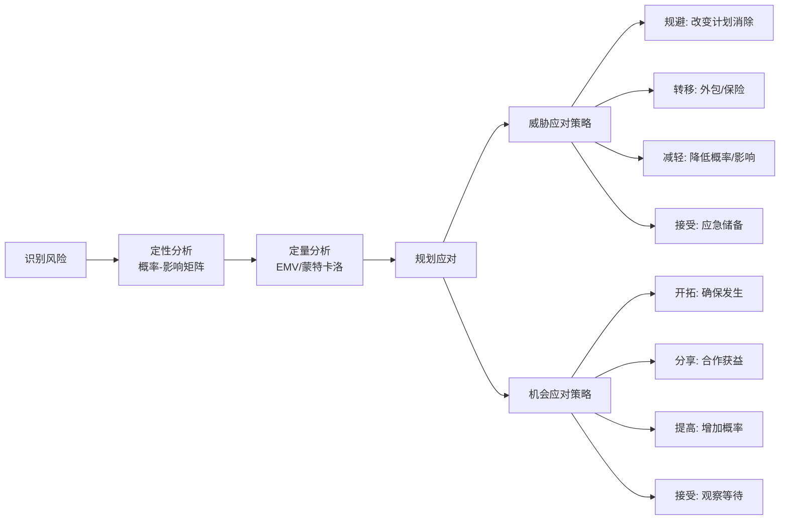
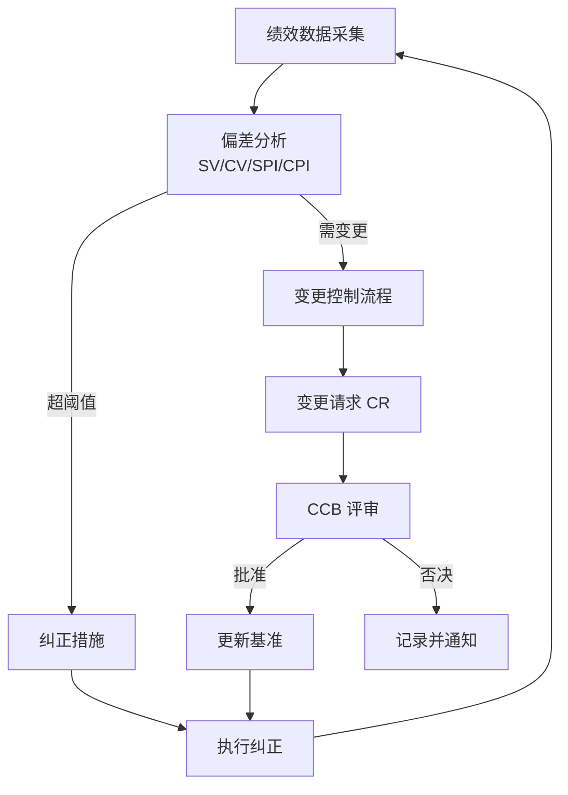
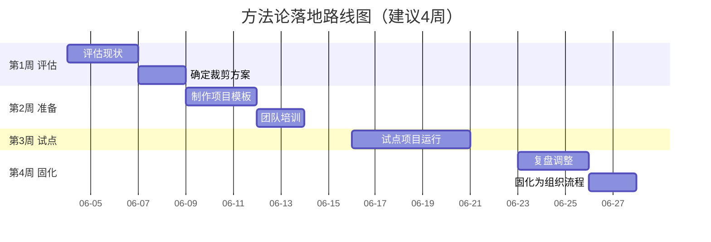

> **版本**：V1.0 | **日期**：2026-06-03 | **适用**：IT 系统开发与交付项目

---

## 一、方法论总览

本方法论以 PMI 项目管理知识体系（PMBOK）为理论基础，融合第 6 版的过程导向与第 7 版的价值导向，适配 IT 系统开发与交付场景。

### 1.1 双框架融合模型



### 1.2 核心原则

| # | 原则 | IT 项目落地含义 |
|---|------|----------------|
| 1 | **管家式管理** | 项目经理是资源的守护者，确保预算、人力、时间的合理使用 |
| 2 | **团队** | 跨职能团队协作，开发/设计/测试/业务缺一不可 |
| 3 | **干系人** | 甲方决策层、业务方、运维方需求识别与期望管理 |
| 4 | **价值** | 每个交付物必须可追溯到业务价值，避免"做了但没用" |
| 5 | **系统思维** | 项目不是孤岛，需考虑与组织架构、现有系统、运维体系的衔接 |
| 6 | **领导力** | 项目经理要在矩阵组织中推动决策，不仅是协调 |
| 7 | **裁剪** | 方法论必须裁剪，小项目轻量运行，大项目完整管控 |
| 8 | **质量** | 交付物的验收标准在规划阶段就定义，收尾不返工 |
| 9 | **复杂性** | 多系统集成、多分公司推广时，识别复杂度并分级管理 |
| 10 | **风险** | 风险不是被动应对，而是主动识别、量化、预留应对预算 |
| 11 | **适应性与韧性** | 需求变更不可避免，建立受控的变更机制而非拒绝变更 |
| 12 | **变革** | 系统上线不是终点，用户采纳和组织变革才是价值实现 |

---

## 二、五大过程组实施指南

### 2.1 启动过程组 — 定方向、锁干系人

**目标**：明确项目存在的理由、获得正式授权、识别关键干系人。



#### 关键交付物

| 交付物 | 内容要求 | 责任人 |
|--------|---------|--------|
| **项目章程** | 项目目的、可测量目标、高层级需求、总体预算、里程碑、审批要求 | 发起人/PM |
| **干系人登记册** | 干系人姓名、角色、影响力/利益矩阵分类、沟通需求、期望 | PM |

#### IT 项目关键动作

1. **需求溯源**：每个需求必须关联到业务痛点或战略目标，拒绝"领导说要"
2. **干系人权力-利益矩阵**：

|  | **低利益** | **高利益** |
|---|---|---|
| **高权力** | 🟡 **令其满意**（Keep Satisfied）<br/>甲方决策层、分管领导<br/>*策略：定期汇报关键进展，不打扰细节* | 🔴 **重点管理**（Manage Closely）<br/>甲方PM、业务部门负责人<br/>*策略：高频沟通，主动管理期望* |
| **低权力** | ⚪ **监督**（Monitor）<br/>外围支持部门、审计<br/>*策略：必要时通知，最小投入* | 🟢 **保持告知**（Keep Informed）<br/>终端用户、运维团队<br/>*策略：定期通报，争取支持与反馈* |

> **使用方法**：把每个干系人按"对项目的影响力（权力）"和"项目对其的影响（利益）"评分1-10，落到对应象限，匹配对应沟通策略。

3. **裁剪决策**：在章程中明确本项目适用哪些过程、文档深度如何——小项目可以合并过程但不可跳过决策

#### 常见陷阱

- ❌ 章程只写"开发XX系统"，没有可量化的成功标准
- ❌ 只识别甲方领导，忽略运维团队和终端用户
- ❌ 启动会变成"开工宴"，没有对齐目标和约束

---

### 2.2 规划过程组 — 定路线、立基准

**目标**：建立完整的范围、进度、成本、质量基准，形成项目管理计划。



#### 2.2.1 范围管理 — 最容易翻车的环节

**WBS 分解原则**：
- 100% 原则：WBS 必须覆盖项目全部范围，不多不少
- 8/80 规则：工作包工作量 8~80 小时（1~10 个工作日）
- 独立可交付：每个工作包有明确的交付物和验收标准

**IT 项目 WBS 示例**：

```
1.0 XX业务系统项目
├── 1.1 需求阶段
│   ├── 1.1.1 业务需求调研
│   ├── 1.1.2 需求规格说明书
│   └── 1.1.3 需求评审与确认
├── 1.2 设计阶段
│   ├── 1.2.1 系统架构设计
│   ├── 1.2.2 数据库设计
│   ├── 1.2.3 UI/UX 设计
│   └── 1.2.4 详细设计评审
├── 1.3 开发阶段
│   ├── 1.3.1 后端开发
│   ├── 1.3.2 前端开发
│   └── 1.3.3 接口联调
├── 1.4 测试阶段
│   ├── 1.4.1 单元测试
│   ├── 1.4.2 集成测试
│   ├── 1.4.3 UAT验收测试
│   └── 1.4.4 性能测试
├── 1.5 部署阶段
│   ├── 1.5.1 环境准备
│   ├── 1.5.2 数据迁移
│   ├── 1.5.3 系统上线
│   └── 1.5.4 上线验证
└── 1.6 收尾阶段
    ├── 1.6.1 培训与交付文档
    ├── 1.6.2 项目复盘
    └── 1.6.3 验收签认
```

#### 2.2.2 进度管理 — 关键路径与缓冲

- **关键路径法（CPM）**：识别零浮动路径，关键路径上的任何延迟都是项目延迟
- **三点估算**：乐观(O)、最可能(M)、悲观(P)，期望时间 = (O + 4M + P) / 6
- **缓冲管理**：非关键路径的浮动时间 ≠ 缓冲；缓冲是主动预留的应急储备

#### 2.2.3 成本管理 — 挣值法

三个核心指标：

| 指标 | 含义 | 公式 |
|------|------|------|
| **PV** | 计划价值 | 到某时点应完成工作的预算 |
| **EV** | 挣值 | 到某时点实际完成工作的预算 |
| **AC** | 实际成本 | 到某时点实际花费 |

四个偏差指标：

| 指标 | 公式 | 含义 | 判断标准 |
|------|------|------|---------|
| **SV** | EV - PV | 进度偏差 | <0 落后 |
| **CV** | EV - AC | 成本偏差 | <0 超支 |
| **SPI** | EV / PV | 进度绩效指数 | <1 落后 |
| **CPI** | EV / AC | 成本绩效指数 | <1 超支 |

#### 2.2.4 风险管理 — 主动防御



#### 常见陷阱

- ❌ 规划阶段投入不足，用"边做边想"替代计划
- ❌ 范围没有 WBS 分解，只有一句"开发完成"
- ❌ 风险登记册是静态文档，从不更新
- ❌ 成本估算只用类比估算，没有自下而上验证

---

### 2.3 执行过程组 — 落地交付、管人管资源

**目标**：按项目管理计划推进项目工作，管理团队与干系人参与。

#### 核心活动

| 活动领域 | 关键动作 | IT 项目重点 |
|---------|---------|------------|
| **团队管理** | 资源获取、团队建设、冲突解决 | 跨部门协作、远程团队沟通机制 |
| **质量保证** | 过程审计、质量检查 | 代码评审、设计评审、测试覆盖率 |
| **沟通管理** | 信息分发、绩效报告 | 周报/站会/里程碑评审节奏 |
| **干系人管理** | 期望管理、参与促进 | 需求确认签收、UAT 组织 |
| **采购管理** | 供应商选择、合同管理 | 外包开发、第三方接口采购 |

#### IT 项目沟通节奏建议

| 频率 | 会议 | 参与人 | 产出 |
|------|------|--------|------|
| 每日 | 站会（15min） | 核心团队 | 阻塞项与今日计划 |
| 每周 | 周例会 | 项目组 + 甲方PM | 周报、风险升级 |
| 双周 | 里程碑评审 | 项目组 + 甲方领导 | 评审纪要、变更请求 |
| 月度 | 挣值分析 | PM + 管理层 | SPI/CPI 报告 |
| 阶段末 | 阶段门评审 | 全体干系人 | Go/No-Go 决策 |

#### 常见陷阱

- ❌ 执行与规划脱节，计划写完就束之高阁
- ❌ 只管进度不管质量，到测试阶段问题爆发
- ❌ 沟通靠"口头传达"，没有书面确认和签收

---

### 2.4 监控过程组 — 偏差纠正、变更受控

**目标**：跟踪项目绩效，管理变更，确保项目按基准推进。



#### 变更控制流程（CCB 机制）

1. **提交**：任何人可提交变更请求（CR），必须说明变更内容、原因、影响
2. **评估**：PM 评估对范围/进度/成本/质量的影响
3. **审批**：CCB（变更控制委员会）决策，重大项目变更需发起人批准
4. **执行**：批准后更新基准与相关文档，执行变更
5. **验证**：确认变更已正确实施

> **铁律**：没有书面的 CR 和审批记录，任何变更不得执行。

#### 绩效报告模板要点

```
项目绩效周报
━━━━━━━━━━━━━━━━━━━━━━━━━━━━
项目名称：xxx    报告周期：MM/DD - MM/DD
━━━━━━━━━━━━━━━━━━━━━━━━━━━━
📊 整体状态：🟢正常 / 🟡关注 / 🔴风险

1. 进度
   - SPI: x.xx | SV: ±xxxx元
   - 本周完成：xxx | 下周计划：xxx

2. 成本
   - CPI: x.xx | CV: ±xxxx元
   - 预算消耗率：xx%

3. 范围
   - 变更请求：新增x / 批准x / 拒绝x
   - 范围蔓延风险：高/中/低

4. 质量
   - Bug统计：新增x / 修复x / 遗留x
   - 严重缺陷：x个

5. 风险
   - 新增风险：xxx
   - 已触发风险：xxx → 应对措施：xxx

6. 事项升级
   - 需要决策：xxx → 责任人：xxx → 截止：xxx
```

---

### 2.5 收尾过程组 — 闭环交付、沉淀经验

**目标**：正式验收交付物，释放资源，归档文档，组织复盘。

#### 收尾检查清单

- [ ] 所有交付物通过验收测试，获得甲方签收
- [ ] 培训完成，用户手册/操作手册交付
- [ ] 源代码/数据库/部署文档归档
- [ ] 合同款项确认与结算
- [ ] 资源释放，团队成员分配到新项目
- [ ] 经验教训登记册完成
- [ ] 项目复盘会完成
- [ ] 项目档案归入组织过程资产

#### 复盘四步法

1. **回顾目标**：项目章程中定义的目标达成了吗？
2. **梳理过程**：哪些做得好？哪些可以改进？
3. **分析原因**：成功/失败的根本原因是什么？
4. **沉淀行动**：哪些经验可以复用？哪些流程需要优化？

---

## 三、十大知识领域速查表

| 知识领域 | 核心关注 | IT 项目关键实践 | 过程数量 |
|---------|---------|----------------|---------|
| **整合** | 项目管理计划的制定与维护、变更控制、阶段衔接 | 项目管理计划整合、CCB机制、阶段门评审 | 7 |
| **范围** | 做且只做所需的工作 | WBS分解、需求跟踪矩阵、范围确认签收 | 6 |
| **进度** | 按时完成 | 关键路径法、敏捷迭代、里程碑驱动 | 6 |
| **成本** | 在批准预算内完成 | 挣值法、成本基准、应急储备管理 | 4 |
| **质量** | 满足需求 | 代码评审、测试策略、验收标准前置定义 | 3 |
| **资源** | 获取和管理团队 | 资源直方图、技能矩阵、冲突解决 | 6 |
| **沟通** | 及时准确的信息传递 | 沟通计划、周报/站会、干系人期望管理 | 3 |
| **风险** | 不确定性管理 | 风险登记册、概率-影响矩阵、风险应对预算 | 7 |
| **采购** | 外部资源获取 | 供应商评估、合同类型选择、SLA管理 | 3 |
| **干系人** | 干系人参与和满意度 | 权力-利益矩阵、参与评估、期望对齐 | 3 |

---

## 四、项目实施阶段门模型

阶段门（Stage-Gate）是在项目关键节点设置"Go / No-Go"决策点，确保项目值得继续推进。


每个 Gate 评审内容：

| Gate | 评审内容 | Go 条件 | 决策者 |
|------|---------|---------|--------|
| G1 立项 | 章程、可行性分析 | 业务价值明确、资源可获取 | 发起人 |
| G2 需求冻结 | 需求规格说明书、原型 | 甲方签收、范围基准锁定 | PM + 甲方PM |
| G3 设计评审 | 架构设计、数据库设计、UI设计 | 技术方案可行、设计符合需求 | 技术评审委员会 |
| G4 代码冻结 | 开发完成、单元测试通过 | 功能完整、P1/P2缺陷清零 | PM + 测试负责人 |
| G5 上线评审 | 测试报告、部署方案、回滚方案 | UAT通过、运维就绪、回滚可行 | CCB |
| G6 验收 | 验收报告、培训记录、文档 | 甲方签字确认 | 甲方决策层 |

---

## 五、裁剪指南 — 不同规模项目的实施策略

### 5.1 裁剪矩阵

| 过程/文档 | 小型项目<br/>（<50万/3个月） | 中型项目<br/>（50-200万/3-6个月） | 大型项目<br/>（>200万/6个月+） |
|-----------|:---:|:---:|:---:|
| 项目章程 | 简版1页 | 标准版 | 详细版+附件 |
| WBS | 2级分解 | 3级分解 | 4级+工作包 |
| 进度计划 | 里程碑级 | 甘特图 | 甘特图+关键路径 |
| 成本管理 | 总额管控 | 挣值月报 | 挣值周报+预测 |
| 风险管理 | Top5风险清单 | 风险登记册 | 登记册+量化分析 |
| 质量管理 | 交付时验收 | 阶段评审 | 持续审计+阶段门 |
| 变更控制 | PM审批 | CCB审批 | CCB+发起人 |
| 沟通管理 | 即时通讯+周报 | 站会+周报+月报 | 全套沟通计划 |

### 5.2 裁剪原则

1. **过程不可省，深度可裁**：每个过程组都要有，但文档深度可以调整
2. **风险驱动裁剪**：风险越高的领域，管控越不能简化
3. **干系人驱动裁剪**：甲方要求越严格，沟通和变更管理越要规范
4. **经验驱动裁剪**：团队越成熟，可以适当简化流程；新手团队则需完整管控

---

## 六、常用工具模板清单

| 序号 | 模板名称 | 用途 | 阶段 |
|------|---------|------|------|
| 1 | 项目章程模板 | 正式授权项目 | 启动 |
| 2 | 干系人登记册 | 识别和管理干系人 | 启动 |
| 3 | WBS模板 | 范围分解 | 规划 |
| 4 | 需求跟踪矩阵 | 需求→设计→代码→测试追溯 | 规划→监控 |
| 5 | 风险登记册 | 风险识别与跟踪 | 规划→监控 |
| 6 | 变更请求表 | 受控变更 | 监控 |
| 7 | 绩效周报模板 | 挣值与进度汇报 | 监控 |
| 8 | 验收报告模板 | 正式签收 | 收尾 |
| 9 | 经验教训登记册 | 知识沉淀 | 全过程 |

---

## 七、IT 项目高频风险与应对

| 风险类别 | 典型表现 | 应对策略 |
|---------|---------|---------|
| **范围蔓延** | "顺便加个功能""就一个小改动" | 需求冻结后任何变更走CR+CCB |
| **需求理解偏差** | 开发完成才发现不是甲方要的 | 原型确认+需求评审签收 |
| **资源不足** | 核心开发被调走 | 资源承诺写进章程、资源直方图预警 |
| **技术风险** | 选型技术栈不成熟 | 技术POC验证、备选方案 |
| **集成风险** | 第三方接口联调失败 | 提前定义接口契约、Mock开发 |
| **进度压缩** | 甲方要求提前上线 | 赶工（加人）或快速跟进（并行），但风险递增 |
| **人员离职** | 关键成员离职 | 知识文档化、AB角配置 |
| **甲方决策延迟** | 需求确认拖2周 | 升级机制+决策时限+默认选项 |

---

## 八、方法论实施路线



### 实施建议

1. **先试点再推广**：选一个中型项目试跑，验证裁剪方案合理性
2. **模板先行**：把核心模板做出来，团队使用门槛就低了
3. **逐步深化**：先跑通5个过程组，再细化10大知识领域
4. **持续迭代**：每个项目收尾时复盘方法论，优化流程和模板

---

> **总结**：方法论不是死板的流程，而是可裁剪的工具箱。核心是 **"每个决策有依据、每个变更受控、每个交付可追溯"**。把这套框架跑起来，项目的可控性和交付质量会有明显提升。
