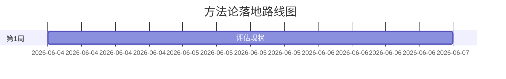
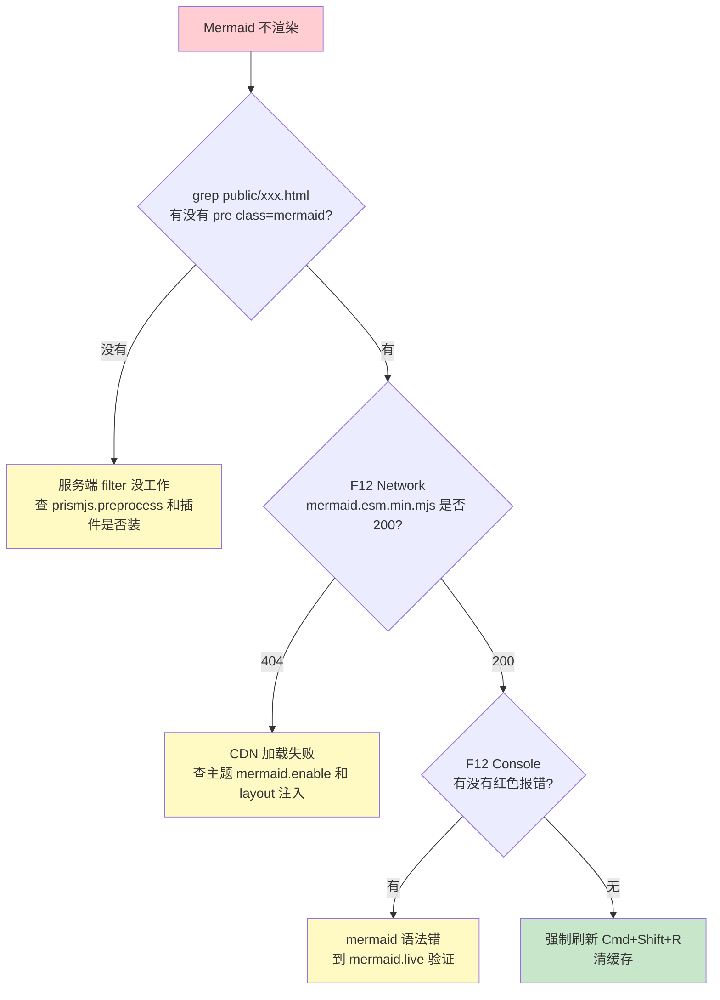

## 写在前面

我有一个用了五六年的 Hexo 博客，主题是 matery，托管在 GitHub Pages + Gitee Pages 双推。最近重新捡起来写东西，结果一个下午连着踩了三个坑：

第一个，文章 URL 默认是 `/2026/06/04/中文标题/`，编码之后就变成一长串 `%E4%B8%AD%E6%96%87` 这种鬼东西，发出去自己都不想点。

第二个，文章里写的 Mermaid 甘特图死活不渲染，浏览器只把 `gantt` 源码当代码块显示，红绿黄三个圆点的代码框样式美得让人心碎。

第三个，写完准备 `hexo d` 上线，被 GitHub 一句 `Permission denied (publickey)` 拒之门外。

每个问题单看都不大，但都不止一层皮。我全程让扣子上的 AI 搭子帮我定位和拍方案，这篇就是把这三个真实排查过程原原本本写下来——重点不在结论，而在那个**层层剥洋葱**的过程。

---

## 案例 1：让中文 URL 消失

### 1.1 问题

Hexo 默认的 `permalink` 是：

```yaml
permalink: :year/:month/:day/:title/
```

`:title` 取的就是 markdown 文件名。中文标题的文件名一编码，URL 立刻变成下面这种灾难：

```text
http://baininghan.github.io/2026/06/04/PMP%E9%A1%B9%E7%9B%AE%E5%AE%9E%E6%96%BD%E6%96%B9%E6%B3%95%E8%AE%BA/
```

不光丑，转发到微信里有时会被截断，SEO 也不友好。

更糟的是，我之前装了 `hexo-permalink-pinyin` 插件，它会把中文转成拼音：

```text
http://baininghan.github.io/2026/06/04/pmp-xiang-mu-shi-shi-fang-fa-lun/
```

拼音确实比 URL 编码好看一点，但还是又长又怪。我想要的是 `/posts/pmp.html` 这种**短、好记、稳定**的形式。

### 1.2 选型对比

问 AI 之后，归纳出来其实就 4 种思路：

| 方案 | 思路 | 缺点 |
|---|---|---|
| A. 手动 permalink | 每篇文章 front-matter 里写死 `permalink: posts/xxx.html` | 麻烦，每篇都要手填 |
| B. 英文文件名 | 文件名直接用英文 | 改写习惯，旧文章批改成本高 |
| C. `:id` 占位符 | 用 Hexo 内置的递增 ID | **ID 不稳定**，每次 `hexo g` 文章顺序变，ID 跟着变，链接会失效 |
| D. abbrlink 插件 | 基于 title+date 计算稳定 hash | 需要装额外插件，但一劳永逸 |

C 方案是个大坑，我一度差点选它——直觉上"自增数字"听起来很合理。结果 AI 直接指出来：Hexo 的 `:id` 是按**当前生成顺序**编号的，新增一篇老文章（比如补一篇旧博客）会让所有 ID 重排，老链接全死。

最后选了方案 D：`hexo-abbrlink` 插件。它基于 `title + date` 算 hash，**只要 title 和 date 不变，链接永远不变**；而且支持手动指定字符串，重要文章可以直接 `abbrlink: pmp`，自动生成的就是 8 位 hash。

### 1.3 落地配置

装插件：

```bash
npm install hexo-abbrlink --save
```

改 `_config.yml`：

```yaml
# permalink 规则换掉
permalink: posts/:abbrlink.html

# 文件末尾追加 abbrlink 配置
abbrlink:
  alg: crc32   # 算法：crc32 / crc16
  rep: hex     # 输出：hex / dec
  drafts: false
```

文章 front-matter 里如果想要可读短名，加一行：

```yaml
---
title: 基于 PMP 的项目实施方法论
abbrlink: pmp
---
```

不加的话，插件会自动生成 8 位 hash，例如 `/posts/4a7b2c91.html`。

主题菜单跳转也得跟着改，比如 `themes/hexo-theme-matery/_config.yml` 里：

```yaml
menu:
  方法论:
    url: /posts/pmp.html
    icon: fas fa-book
```

### 1.4 一个容易忽略的坑

改完 permalink 之后我立刻 `hexo s` 预览，结果还是老的丑 URL。折腾了半天才发现：必须 `hexo clean && hexo g`，单纯 `hexo s` 不会重新生成 public 目录。这条经验后来贯穿整个下午——**改任何 hexo 配置，先 clean 再 g，省下半小时困惑**。

另外那个 `hexo-permalink-pinyin` 拼音插件不用卸载，它在新的 abbrlink 体系下不会再生效（因为 `:title` 已经从 permalink 里去掉了），留着不影响。

---

## 案例 2：Mermaid 甘特图死活不渲染（这是真硬骨头）

这是当天最痛的一个坑，前后改了 6 轮才彻底解决。值得详细写。

### 2.1 起点：老插件 hexo-tag-mermaid 的五大坑

我之前用的是 `hexo-tag-mermaid`，写法是：

```text

graph LR
A --> B

```

文章里写了 6 张流程图都没问题，到第 7 张甘特图就崩了。我开始以为是语法错，反复改 `gantt` 的 dateFormat、section、task 写法，全是徒劳。

后来跟 AI 一起逐张图对比成功和失败的写法，挖出了这个老插件的**五个雷区**：

**雷 1：块内不能有空行**。`...` 中间一个空行，整块图就被截断成两段，源码以纯文本暴露。我有一张图就是因为为了"美观"在 `style` 节前面加了空行——直接挂掉。

**雷 2：边标签里的 HTML 失败**。`A -->|"Gate 1<br/>立项评审"| B` 这种带 `<br/>` 的箭头标签，无论加不加引号都渲染失败。节点标签 `[...]` 里的 `<br/>` 反而稳定。

**雷 3：`style` 多属性逗号语法不支持**。`style A fill:#xxx,stroke:#yyy` 这种多属性写法，老版 mermaid 直接报错，只能写单属性 `style A fill:#xxx`。

**雷 4：`subgraph` 不稳**。带 `subgraph` 的图在老插件下渲染不稳定，时好时坏。

**雷 5：根本不支持 `gantt`**。这就是我那张甘特图死活渲染不出来的真正原因——`hexo-tag-mermaid` 2019 年之后就停止维护了，内置的 mermaid 还是 v8.x 早期版本，根本没有 gantt 解析器。

定性之后，方案很清晰：**换插件**。

### 2.2 换插件 hexo-filter-mermaid-diagrams

```bash
npm uninstall hexo-tag-mermaid
npm install hexo-filter-mermaid-diagrams --save
```

文章里的写法也跟着换，从标签语法换成标准 markdown 代码块：

````text

````

7 张图一起改，AI 用 `edit_file` 的 `replace_all` 一把搞定，没让我手动改。

跑 `hexo clean && hexo g && hexo s`，刷新——

**还是没渲染。**

### 2.3 第二大坑：prismjs 偷偷拦截了代码块

冷静下来排查。Hexo 默认带了 `prismjs` 做代码高亮，配置长这样：

```yaml
prismjs:
  enable: true
  preprocess: true   # <-- 罪魁祸首
```

`preprocess: true` 表示在 Hexo 渲染流水线的**早期**，prismjs 就把所有 ```` ``` ```` 代码块预处理成高亮 HTML，包括 ` ```mermaid `。等到 `hexo-filter-mermaid-diagrams` 想匹配 mermaid 代码块时，看到的已经是 prismjs 处理过的 HTML，正则匹配不上，自然就跳过了。

修复一行配置：

```yaml
prismjs:
  enable: true
  preprocess: false   # 让 prism 改在浏览器端做高亮
```

`preprocess: false` 之后，prism 改用客户端 JS 高亮，mermaid filter 就能在服务端先一步拿到原始代码块处理掉。

重跑 `hexo clean && hexo g`，刷新——

**还是没渲染。**

这时候我已经有点想砸键盘了。

### 2.4 第三大坑：HTML 标签对了，但浏览器没 mermaid.js

AI 让我直接 grep 看生成的 `public/posts/pmp.html`：

```bash
grep -n "mermaid" public/posts/pmp.html
```

输出是这样的：

```text
1146:<pre class="mermaid">gantt
1147:    title 方法论落地路线图...
```

服务端的 HTML 没问题——`<pre class="mermaid">` 标签生成对了，gantt 源码也完整。问题在浏览器端。再 grep：

```bash
grep "mermaid.*\.js\|mermaid\.initialize" public/posts/pmp.html
```

**没有任何结果。**

原来这就是根因：`hexo-filter-mermaid-diagrams` 这个插件**只做服务端 HTML 替换**，把 ` ```mermaid ` 翻译成 `<pre class="mermaid">...</pre>` 就完事了，**它根本不负责加载 mermaid.js 库**。

我之前为了"避免重复加载"，把主题的 `theme.mermaid.enable` 关掉了，结果两边都不管：

- 服务端把代码块替换成了正确的 `<pre class="mermaid">` ✅
- 浏览器端没有 mermaid.js，也没有 `mermaid.initialize()` ❌
- 结果：浏览器只把 `<pre>` 当普通 pre 标签渲染，里面的 gantt 源码作为纯文本展示

### 2.5 最终方案

修复策略很直接：

**第一步**，主题 `_config.yml` 把 `theme.mermaid.enable` 改回 `true`：

```yaml
mermaid:
  enable: true   # 让 layout.ejs 走加载分支
```

**第二步**，改 `themes/hexo-theme-matery/layout/layout.ejs`，把主题自带的老版 mermaid.js 换成 CDN 上的 v10 ESM 模式：

```html
<% if (theme.mermaid.enable) { %>
    <script type="module">
      import mermaid from 'https://cdn.jsdelivr.net/npm/mermaid@10.9.1/dist/mermaid.esm.min.mjs';
      mermaid.initialize({
        startOnLoad: true,
        theme: 'forest',
        securityLevel: 'loose'
      });
    </script>
<% } %>
```

几个关键参数：

- `startOnLoad: true` —— 让 mermaid 自动扫描页面上所有 `.mermaid` class 的元素并渲染，不用手写 `mermaid.run()`
- `securityLevel: 'loose'` —— 允许中文标签、HTML 内嵌、点击事件，默认 `strict` 会过滤掉很多东西
- ESM 模式 —— mermaid v10 推荐的加载方式，按需加载子模块，体积更小

`hexo clean && hexo g && hexo s`，强制刷新（Cmd+Shift+R，老 JS 有缓存），打开页面——

**7 张图全部正常渲染**，第八章的甘特图也终于出来了，绿底白条带时间轴，漂亮。

### 2.6 这个坑给我的教训

整个排查链有 4 层：

```text
markdown 源码 → Hexo 渲染管线（含 prismjs/filter）→ HTML 文件 → 浏览器 + mermaid.js
```

**任何一层断掉，前面做对都没用**。最隐蔽的是第 4 层——你看 HTML 文件里 `<pre class="mermaid">` 都正确生成了，会下意识觉得"已经搞定了"，但浏览器端还差最后一步。

后来我把这个完整的诊断顺序沉淀成"三步走"：



按这个图走，下次 5 分钟搞定。

---

## 案例 3：hexo deploy 报 Permission denied

这个相对简单，但我还是踩了。

执行 `hexo d`，报：

```text
git@github.com: Permission denied (publickey).
致命错误：无法读取远程仓库。
请确认您有正确的访问权限并且仓库存在。
```

第一反应是 GitHub 改密了或者仓库被删了。AI 一句话让我冷静下来——`Permission denied (publickey)` 是**纯 SSH 公钥认证问题**，跟 hexo 配置无关，根因只有三种：

1. 本地没生成 SSH key
2. 生成了但没加到 GitHub
3. 加了但 ssh-agent 没加载

定性命令一行：

```bash
ssh -T git@github.com
```

返回三种结果之一：

- `Hi xxx! You've successfully authenticated` → 认证通过，问题在 hexo deploy 配置（去查 `_config.yml` 的 `repo` 是不是写成了 HTTPS）
- `Permission denied (publickey)` → key 没配或没生效（去 `~/.ssh/` 看，没有就 `ssh-keygen`，有就 `pbcopy < ~/.ssh/id_ed25519.pub` 加到 GitHub）
- `Host key verification failed` → 首次连接没确认，输 `yes` 接受指纹

我的情况是中间那个——以前的 Mac 报废过一次，新机器 SSH key 重新生成过，但忘了加到 GitHub。

macOS 重启后 ssh-agent 不自动加载 key 也是高频坑，根治方法是 `~/.ssh/config` 加一段：

```text
Host *
  AddKeysToAgent yes
  UseKeychain yes
  IdentityFile ~/.ssh/id_ed25519
```

加完一劳永逸。

---

## 和 AI 搭子协作的几点真实感受

写完这三个案例，回头想想，有几条经验是真有用的：

**第一，让 AI 先定性，再分步**。比如 mermaid 那个坑，如果一上来就开始改配置，会陷入"试一个不行换一个"的死循环。AI 真正帮我的是先帮我把"插件 vs 主题 vs 浏览器"这三层切开，每层独立验证。定性比试错重要。

**第二，别让 AI 凭空编**。AI 是会编的，特别是 Hexo 这种插件版本碎片化、文档不全的生态。我后来定了个规矩：**任何"配置应该是这样"的建议，先 grep 真实文件看一眼**。这次 mermaid 第四层问题就是这么找到的——AI 一开始也以为加了配置就行了，直到我们一起去 grep `public/posts/pmp.html`，才发现根本没有 mermaid.js 加载脚本。**真实文件不会骗人**。

**第三，解一个、记一个**。AI 有上下文窗口限制，长对话会丢记忆。但你可以让它把每个坑沉淀成可复用的笔记。我现在有一份 `TOOLS.md`，里面记着今天这三个坑的完整经验，下次同类问题第一时间能找到。AI 的记忆靠不住，纸面经验靠得住。

**第四，AI 不是万能定海神针，但能帮你少走 80% 弯路**。SSH 问题如果我自己 Google，至少要点开 5 个 StackOverflow 帖子才能定位到"这三类根因"；mermaid 问题更夸张——网上几乎没有完整描述"四层链路"的文章，全是只解决其中一层的零散方案。AI 的优势是**把碎片信息收敛成决策树**，让你按顺序走，不至于乱试。

**第五，吐槽和情绪很重要**。这是我自己的体会。当一个问题反复失败，我会直接跟 AI 说"已经第 N 次了你是不是不行"。AI 也不会真生气，但被这么一刺激，下一轮回答会从"再调一下配置吧"切换到"我直接去看你的真实文件，从源头定位"。表达情绪不是发泄，是给协作加一个"重置档位"的信号。

---

## 配置速查表

下面是这次最终落地的全套配置，照着抄就能复刻：

**1. 装插件**

```bash
npm install hexo-abbrlink hexo-filter-mermaid-diagrams --save
npm uninstall hexo-tag-mermaid
```

**2. 根 `_config.yml`**

```yaml
# URL 短名
permalink: posts/:abbrlink.html

# 关掉 prism 服务端高亮，给 mermaid filter 让路
prismjs:
  enable: true
  preprocess: false

# 文件末尾
abbrlink:
  alg: crc32
  rep: hex
  drafts: false
```

**3. 主题 `themes/hexo-theme-matery/_config.yml`**

```yaml
mermaid:
  enable: true
```

**4. 主题 `themes/hexo-theme-matery/layout/layout.ejs`**

把原来的 mermaid 加载块替换成：

```html
<% if (theme.mermaid.enable) { %>
    <script type="module">
      import mermaid from 'https://cdn.jsdelivr.net/npm/mermaid@10.9.1/dist/mermaid.esm.min.mjs';
      mermaid.initialize({
        startOnLoad: true,
        theme: 'forest',
        securityLevel: 'loose'
      });
    </script>
<% } %>
```

**5. SSH 部署**

`~/.ssh/config`：

```text
Host *
  AddKeysToAgent yes
  UseKeychain yes
  IdentityFile ~/.ssh/id_ed25519
```

**6. 文章 front-matter 范例**

```yaml
---
title: 你的中文标题
date: 2026-06-04 12:00:00
abbrlink: your-short-name
---
```

---

## 写在最后

整个下午，从 14 点写文章到 19 点上线，5 个小时里大概 4 个小时在解 bug，1 个小时在写字。这个比例并不算夸张——技术博客本身就是工程作品，每一篇能正常显示、URL 漂亮、Mermaid 渲染、SSH 部署都是一个个小工程。

但是有意思的是，**这些坑都不是新坑**。Hexo 的 mermaid 渲染问题、abbrlink 选型、SSH 配置，网上搜索都能找到一堆文章。问题是这些文章往往只覆盖其中一层，你按那篇做完跑不通，又去搜下一篇——一个问题被切成 5 个网页，每个网页都对了一半。

AI 协作的真正价值，是**把这些切碎的知识在你自己的场景下重新拼起来**。它读你的 `_config.yml`、读你的 `layout.ejs`、grep 你的 `public/*.html`，然后告诉你：你这个版本的主题，加上你装的这套插件，缺的是这一行配置。

这是检索引擎做不到的事，也是我愿意把这个下午写下来的原因——不是炫耀解决了多复杂的问题，而是想说：**有些工程问题，找对协作方式比找对答案更重要**。

---

> 文章涉及的所有配置，已经在我自己的博客上跑通；如果你按这篇操作仍然踩坑，欢迎在评论区告诉我，可能我们一起又能挖出第 N 层。
